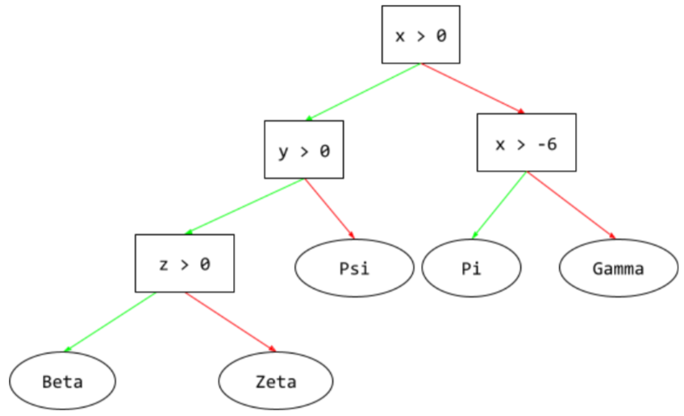

# Sports-Predictions
A machine learning framework for sport result prediction

Credit: KARE

## Background

### How Does Machine Learning Predict Sports Match Outcomes?

One of the common machine learning (ML) tasks, which involves predicting a target variable in previously unseen data, is classification. The aim of classification is to predict a target variable (class) by building a classification model based on a training dataset, and then utilizing that model to predict the value of the class of test data. This type of data processing is called supervised learning since the data processing phase is guided toward the class variable while building the model (see Fig. 1). Some common applications for classification include loan approval, medical diagnoses, email filtering, among others.

 

## Project Overview

### Purpose

Sport prediction is usually treated as a classification problem, with one class (win, lose, or draw) to be predicted. Although some researchers, have also looked at the numeric prediction problem, where they predict the winning margin – a numeric value. In sport prediction, large numbers of features can be collected including the historical performance of the teams, results of matches, and data on players, to help different stakeholders understand the odds of winning or losing forthcoming matches. The decision of which team is likely to win is what we are aimimg to predict.

### Questions to be answer:

1. Which team is likely to win a championship or arrive in 1st place?

2. Which team is likely to win subchampionship or arrive in 2nd place?

3. What model had a higher accuracy?

4. Challenges during the project

### Metodology:

To achive our goal we will use the following apporach:

 

## Resources

### Database
•	Data was scrapped from https://www.basketball-reference.com/ , saved as .csv. (between season 1997-98 to 2021-22)
•	Total of twenty five tables, one for every season.

#### Glossary

Rk -- Rank

Age -- Player's age on February 1 of the season

W -- Wins

L -- Losses

PW -- Pythagorean wins, i.e., expected wins based on points scored and allowed

PL -- Pythagorean losses, i.e., expected losses based on points scored and allowed

MOV -- Margin of Victory

SOS -- Strength of Schedule; a rating of strength of schedule. The rating is denominated in points above/below average, where zero is average.

SRS -- Simple Rating System; a team rating that takes into account average point differential and strength of schedule. The rating is denominated in points above/below average, where zero is average.

ORtg -- Offensive Rating
An estimate of points produced (players) or scored (teams) per 100 possessions

DRtg -- Defensive Rating
An estimate of points allowed per 100 possessions

Pace -- Pace Factor: As estimate of possessions per 40 minutes

TS% -- True Shooting Percentage
A measure of shooting efficiency that takes into account 2-point field goals, 3-point field goals, and free throws.

#### Offense Four Factors

eFG% -- Effective Field Goal Percentage
This statistic adjusts for the fact that a 3-point field goal is worth one more point than a 2-point field goal.

TOV% -- Turnover Percentage An estimate of turnovers committed per 100 plays.

ORB% -- Offensive Rebound Percentage An estimate of the percentage of available offensive rebounds a player grabbed while they were on the floor.

FT/FGA -- Free Throws Per Field Goal Attempt

#### Defense Four Factors

Opp_eFG% -- Opponent Effective Field Goal Percentage

Opp_TOV% -- Opponent Turnover Percentage

Opp_DRB% -- Defensive Rebound Percentage An estimate of the percentage of available defensive rebounds a player grabbed while they were on the floor.

* season_stats.csv

* Dataset was created merging different tables for with different stats into one dataset and saved as season_stats.csv
* Data was scrapped from https://www.basketball-reference.com/wnba/years/1997.html#all_totals-team-opponent

### Software:

* Jupyter Notebook

* Python

* Pandas

* sqlalchemy

* scikit-Learn

* matplotlib

* seaborn

* PostgreSQL

* Tableau

* HTML template

## Project Outline

### Power Point / G Slides Presentation:

Mark

* We will create a PP or Google Slides  for our live presentation.

### Database:

Rafael

* We will use PostrgeSQL for our database

### Machine Learning:

Leonardo

**Segment 1, For all 3 models:**

- Mock models used **dummie data**, we'll be building the model on this to produce the final outcome.

- Model were able to **connect to postgreSQL database**, extract the data and **provide an output**. 

#### Logistic Regression

A type of regression model that predicts a probability. Logistic regression models have the following characteristics:

The label is categorical. The term logistic regression usually refers to binary logistic regression, that is, to a model that calculates probabilities for labels with two possible values. A less common variant, multinomial logistic regression, calculates probabilities for labels with more than two possible values.

The loss function during training is Log Loss. (Multiple Log Loss units can be placed in parallel for labels with more than two possible values.)
The model has a linear architecture, not a deep neural network. However, the remainder of this definition also applies to deep models that predict probabilities for categorical labels.

#### Decision Tree
A supervised learning model composed of a set of conditions and leaves organized hierarchically.

#### Random Forest

An ensemble of decision trees in which each decision tree is trained with a specific random noise, such as bagging.

Random forests are a type of decision forest.

We may explore other models as we start working on the project

 

### Visualization:

Mark

* We wil use **Tableau** as our main visualization plataform for Story telling.

* Also will use Matplotlib and Seaborn for our notebook, PP and README visualizations.

### Deployment:

Mark/Rafael/Leonardo

* We will use Javascript, HTML/CSS to create a webpage to deploy our project

* webpage may be hosted at github pages or clouflare pages, but will explore other rich content options. 

## Summary:

## References:

[Markdown](https://docs.github.com/en/get-started/writing-on-github/getting-started-with-writing-and-formatting-on-github/basic-writing-and-formatting-syntax)

[scikit-learn](https://scikit-learn.org/stable/)
 
[TensorFlow](https://www.tensorflow.org/)

[matplotlib](https://matplotlib.org/stable/api/_as_gen/matplotlib.pyplot.savefig.html)

[Google Machine Learning Glosary](https://developers.google.com/machine-learning/glossary#l)

[Applied Computing and Informatics (Journal)](https://www.sciencedirect.com/science/article/pii/S2210832717301485)

