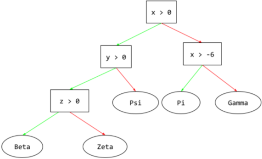
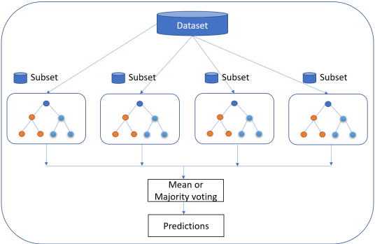
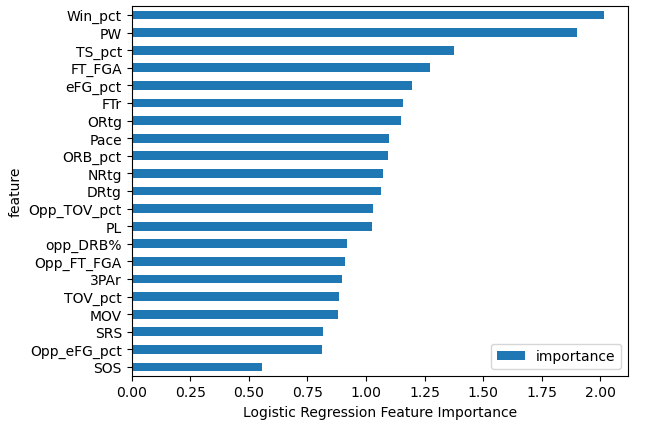
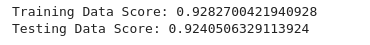

# Sports-Predictions
A machine learning framework for sport result prediction

[Image source](https://media.kare11.com/assets/KARE/images/da18568b-9a32-4b67-8560-3ea9bb330207/da18568b-9a32-4b67-8560-3ea9bb330207_750x422.png)

## Background

### How Does Machine Learning Predict Sports Match Outcomes?

One of the common machine learning (ML) tasks, which involves predicting a target variable in previously unseen data, is classification. The aim of classification is to predict a target variable (class) by building a classification model based on a training dataset, and then utilizing that model to predict the value of the class of test data. This type of data processing is called supervised learning since the data processing phase is guided toward the class variable while building the model (see Fig. 1). Some common applications for classification include loan approval, medical diagnoses, email filtering, among others.(6)

Fig. 1.1 Supervised learning versus unsupervised learning. Credit Applied Computing and Informatics

 

## Project Overview

### Purpose

Sport prediction is usually treated as a classification problem, with one class (win, lose, or draw) to be predicted. Although some researchers, have also looked at the numeric prediction problem, where they predict the winning margin – a numeric value. In sport prediction, large numbers of features can be collected including the historical performance of the teams, results of matches, and data on players, to help different stakeholders understand the odds of winning or losing forthcoming matches.The decision of which team is likely to win is what we are aimimg to predict.(6)

### Questions to be answer:

1. Which team is most likely to win a championship or arrive in 1st place?

2. Which team is most likely to arrive in 2nd place?

3. What model had a higher accuracy?

4. Challenges during the project

### Methodology:

To achive our goal we will use CRISP-DM framework apporach:

Fig. 1.2 The six phases of our ML model project. Credit Applied Computing and Informatics

 

## Communication Protocol

* Team is currently meeting twice per week via Slack and communicate via DM as needed.

    * Leonardo - GitHub, Machine Learning.
    * Rafael - Dataset, Database
    * Mark - Presentation, Visualization (Dashboard)

 

## Resources

### Database source
•	Data was scrapped from https://www.basketball-reference.com/ , saved as .csv. (between season 1997-98 to 2021-22)
•	Total of twenty five tables, one for every season.

#### Glossary

Rk -- Rank

Age -- Player's age on February 1 of the season

W -- Wins

L -- Losses

PW -- Pythagorean wins, i.e., expected wins based on points scored and allowed

PL -- Pythagorean losses, i.e., expected losses based on points scored and allowed

MOV -- Margin of Victory

SOS -- Strength of Schedule; a rating of strength of schedule. The rating is denominated in points above/below average, where zero is average.

SRS -- Simple Rating System; a team rating that takes into account average point differential and strength of schedule. The rating is denominated in points above/below average, where zero is average.

ORtg -- Offensive Rating
An estimate of points produced (players) or scored (teams) per 100 possessions

DRtg -- Defensive Rating
An estimate of points allowed per 100 possessions

Pace -- Pace Factor: As estimate of possessions per 40 minutes

TS% -- True Shooting Percentage
A measure of shooting efficiency that takes into account 2-point field goals, 3-point field goals, and free throws.

#### Offense Four Factors

eFG% -- Effective Field Goal Percentage
This statistic adjusts for the fact that a 3-point field goal is worth one more point than a 2-point field goal.

TOV% -- Turnover Percentage An estimate of turnovers committed per 100 plays.

ORB% -- Offensive Rebound Percentage An estimate of the percentage of available offensive rebounds a player grabbed while they were on the floor.

FT/FGA -- Free Throws Per Field Goal Attempt

#### Defense Four Factors

Opp_eFG% -- Opponent Effective Field Goal Percentage

Opp_TOV% -- Opponent Turnover Percentage

Opp_DRB% -- Defensive Rebound Percentage An estimate of the percentage of available defensive rebounds a player grabbed while they were on the floor.

### Software and tools:

* Jupyter Notebook

* Python

* Pandas

* sqlalchemy

* scikit-Learn

* matplotlib

* seaborn

* QuickDBD

* PostgreSQL

* Tableau

* HTML template

## Project Outline

### Presentation:

[**Sports-Predictions Slides Presentation**](https://docs.google.com/presentation/d/10bAOWkrWM3veIdgE84QRVg1vOGXGeJDbY-aToJUFGBc/edit?usp=sharing)

* Google Slides  for our live presentation.

### Database:

* We used PostrgeSQL for our database: wnba_champs

* Data was scrapped from Data was scrapped from https://www.basketball-reference.com/, saved as .csv(wnba_stats.csv, cy_stats.csv, cy_stats2.csv)

* Total of three tables, one for past years data(wnba_stats.csv), one individual table for current year stats, and one individual table for dummie_current_year using wnba historical data. Tables were saved as follow, (cy_stats.csv, cy_stats2.csv).

* Datasets loaded into PostgreSQL database using python. (database_initial_load.ipynb)

* Column name changed inside database

* All 3 datasets consist of the same columns/features. This columns/features consisted of Win pct, Margin of victory, Pace, Offensive rating, Defensive rating plus five columns with team advance stats and another five with opponents advance stats

* A separate config.py file will be needed with the db_password variable the password for the database

* Database wnba_champs_ERD was created using (QuickDBD) as shown in image 1.3

 

Fig. 1.3 wnba_champs_ERD

 

## Machine Learning Model

### Preliminary data preprocessing
 
* Missing or null values were checked pre-database creation-none found.
 
* Import from PostgreSQL and read into the data frame.
 
* Missing or null values were checked within each ML code, post-database import -none found.
 
* Column’s ‘Season’ and ‘Name’ assigned to separate data frames for later use.
 
* Columns of no value dropped from the data frame.
 
* Columns determined from feature exploration - not needed columns were dropped.
 
* Feature names were set as variables for later use.
 
* Data set split into train/test sets.
 
* Data scaled to normalize.
 
* Checked that all values were numerical using "X.describe()".
 
* Encoding was not used as all value-added data is numerical

### Data Processing

* Data (season_stats.csv) trained through ML model, feature importance explored

* Features pruned

* Data (cy_stats.csv) passed through ML model to predict target – ‘Position’

### Preliminary feature engineering and selection

Fig 1.4 Feature_Importance per team (2021-2002) - visualization of feature_importance contribution to team performance

 

   
Fig 1.5 Teams ranked per most important feature_importance (2021-2022) - From all the featurs in the dataset, W/L% seems to have the most contribution.

### Explain model choice:
* Supervised Machine Learning models were chosen due to the data having a label "Position".

### Logistic Regression

A type of regression model that predicts a probability. Logistic regression models have the following characteristics:

The label is categorical. The term logistic regression usually refers to binary logistic regression, that is, to a model that calculates probabilities for labels with two possible values. A less common variant, multinomial logistic regression, calculates probabilities for labels with more than two possible values.

The loss function during training is Log Loss. (Multiple Log Loss units can be placed in parallel for labels with more than two possible values.)
The model has a linear architecture, not a deep neural network. However, the remainder of this definition also applies to deep models that predict probabilities for categorical labels.

#### Limitations

* If the number of observations is lesser than the number of features, Logistic Regression should not be used, otherwise, it may lead to overfitting.
* The major limitation of Logistic Regression is the assumption of linearity between the dependent variable and the independent variables.

#### Benefits

* Logistic regression is easier to implement, interpret, and very efficient to train.
* It makes no assumptions about distributions of classes in feature space.
* It can easily extend to multiple classes (multinomial regression) and a natural probabilistic view of class predictions.
* It is very fast at classifying unknown records.

 Fig. 1.6 Logistic Regression plot. Credit srikarkatta.wordpress

### Decision Tree
Decision Trees are a type of Supervised Machine Learning where the data is continuously split according to a certain parameter. The tree can be explained by two entities, namely decision nodes and leaves organized hierarchically. The leaves are the decisions or the final outcomes. And the decision nodes are where the data is split.

#### Limitations
* A small change in the data can cause a large change in the structure of the decision tree causing instability.

* For a Decision tree sometimes, calculation can go far more complex compared to other algorithms.

* Decision tree often involves higher time to train the model.

* Decision tree training is relatively expensive as the complexity and time has taken are more.

* The Decision Tree algorithm is inadequate for applying regression and predicting continuous values.

#### Benefits
* Compared to other algorithms, decision trees requires less effort for data preparation during pre-processing.

* A decision tree does not require normalization of data.

* A decision tree does not require scaling of data as well.

* Missing values in the data also do NOT affect the process of building a decision tree to any considerable extent.

* A Decision tree model is very intuitive and easy to explain to technical teams as well as stakeholders.

 Fig. 1.7 Decision Tree schema. Credit Google machine Learning Dictionary

### Random Forest
 
Random Forest is perhaps the most popular classification algorithm, capable of both classification and regression and can accurately classify large volumes of data. The name “Random Forest” is derived from the fact that it is an ensemble of decision trees in which each decision tree is trained with a specific random noise, such as bagging.
 
While individual trees might be “weak learners,” the principle of Random Forest is that together they can comprise a single “strong learner.”
 
#### Limitations
 
* Complexity: Random Forest creates a lot of trees (unlike only one tree in case of decision tree) and combines their outputs. By default, it creates 100 trees in the Python sklearn library. To do so, this algorithm requires much more computational power and resources. On the other hand, the decision tree is simple and does not require so much computational resources.
 
* Longer Training Period: Random Forest requires much more time to train as compared to decision trees as it generates a lot of trees (instead of one tree in case of decision tree) and makes decisions on most votes.
 
#### Benefits
   
* Are robust against overfitting as all those weak learners are trained on different pieces of the data.
 
* Can be used to rank the importance of input variables in a natural way.
 
* Can handle thousands of input variables without variable deletion.
 
* Are robust to outliers and nonlinear data.
 
* Run efficiently on large datasets.

 Fig. 1.8 Random Forest schema. Credit insightsoftware

 

### How data was split into training and test sets:
* Data was split using sk.learn train_test_split dependencies with the default **75/25** split.

 

### Results Overview:

### Logistic Regression

* Features were explored using Coefficients **(COEF)**, Recursive Feature Elimination **(RFE)** and Select from Model **(SFM)** methods for the Logistic Regression model. (Fig 1.9)
* All three methods produced lower accuracy results then using all features
* All features used in model
* Model accuracy score: **0.9241** (Fig. 1.10)
* Predicted winner test_1: **Las Vegas Aces (LVA) - 60.9%**
* Predicted winner test_2: **Minnesota Lynx 29.5%**

 Fig. 1.9 Logistic Regression feature importance.

 

 Fig. 1.10 Logistic Regression accuracy score.

 

### Decision Tree
* Features were ranked using model.feature_importances_ (Fig. 1.11)
* The bottom 8 features played no importance in the model outcome or accuracy
* Top 13 features used in model
* Model accuracy score: **0.9241** (Fig. 1.12)
* Predicted winner test_1: The most probable winners were **Connecticut Sun and Las Vegas Aces**.
* Predicted winner test_2: **Minnesota Lynx**

 Fig. 1.11 Decision Tree feature importance.

 

 Fig. 1.12 Decision Tree accuracy score.

 

### Random Forest
* Features were ranked using model.feature_importances_ (Fig. 1.13)
* All features used to give model more data to train with
* Model accuracy score: **0.9240** (Fig. 1.14)
* Predicted winner test_1: **Connecticut Sun - 77.0%**
* Predicted winner test_2: **Minnesota Lynx 52.0%**

 Fig. 1.13 Random Forest feature importance.

 

 Fig. 1.14 Random forest accuracy score.

 

## Dashboards & Visualizations
   
* ### [Machine Learning Storyboard](https://public.tableau.com/views/WNBAPredictions/Story1?:language=en-US&:display_count=n&:origin=viz_share_link)

* ### [Explore the Data Storyboard](https://public.tableau.com/views/WNBAPredictionData/Story1?:language=en-US&publish=yes&:display_count=n&:origin=viz_share_link)

* ### [WNBA Predictions Google Slides Presentation](https://docs.google.com/presentation/d/10bAOWkrWM3veIdgE84QRVg1vOGXGeJDbY-aToJUFGBc/edit?usp=sharing)

#### Resources
* Tableau Public
   
* Datasets (wnba_stats.csv, cy_stats.csv, cy_stats2.csv) loaded into Tableau

* Storyboard created

* Storyboard saved to Tableau public  https://public.tableau.com/views/WNBAPredictionData/WNBAPredictionData?:language=en-US&:display_count=n&:origin=viz_share_link

## Deployment:

* ### [WNBA Predictions Web Page](https://sports-predictions.pages.dev/)

 Web-page deployed using cloudflare pages

 
   
## Summary:

* The accuracy for the three models were very close, with the highest accuracy achieved by Logistic Regression, and  Decision Tree with **92.41%**
* For our test_1, season 2022 was used as current year data:
    * The three models were able to accurate predict the most probable winner for season 2022 - **Las Vegas Aces**
    * The three models were able to accurate predict the most probable 2nd place or sub champion for season 2022 - **Connecticut Sun**
 
* For our test_2, a random WNBA historical data was used to create season data to be used as current.
    * The three models were able to accurate predict the most likely winner from a random dummy season - **Minnesota Lynx**

Actual results: For our test_1 we used the last season of WNBA data as current year. The models did a good job predicting the most probable winners for the season (2022). During the regular season, the Connecticut Suns arrived in 1st place and the Las Vegas Aces arrived in 2nd place, however the Las Vegas Aces won the championship. This correlates with all our models that had COS in 1st place and LAV in 2nd place. The data analysis demonstrates that not always the team with the best record and stats wins the championship. There are other factors that can influence the outcome of a season, like team cohesion, experience, coaching, etc.
   
For our test_2 we created a dummy dataset using actual WNBA historical data and used it as "current year". The intention was to evaluate if the model was able to accurately predict a winner with an unknown dataset. All 3 models were able to predict the most probable winner, the Minnesota Lynx. The 3 models did a great job predicting a most probable winner based on team stats as the Minnesota Lynx were the team with the best stats and greater margin over victory among all the teams in the dataset. Actual results: the Minnesota Lynx was the WNBA champion for season 2017.

## Challenges:
 
* We had some challenges during the feature exploration, understanding which method to use to find feature importance for each model was an important factor for the ML model since that could affect the overall model performance.
 
* Selecting what features to drop to improve our model accuracy was also challenging. Dropping features was based on the feature_importance method, used to find the influence of each feature on our model accuracy. However we find out that dropping too many features would cause toe accuracy to drop.
 
* We had some challenges when selecting what type of dashboards to create. Choosing which features would showcase the nature of our project.

 

## References:

1.[Markdown](https://docs.github.com/en/get-started/writing-on-github/getting-started-with-writing-and-formatting-on-github/basic-writing-and-formatting-syntax)

2.[scikit-learn](https://scikit-learn.org/stable/)
 
3.[TensorFlow](https://www.tensorflow.org/)

4.[matplotlib](https://matplotlib.org/stable/api/_as_gen/matplotlib.pyplot.savefig.html)

5.[Google Machine Learning Glosary](https://developers.google.com/machine-learning/glossary#l)

6.[Applied Computing and Informatics (Journal)](https://www.sciencedirect.com/science/article/pii/S2210832717301485)
